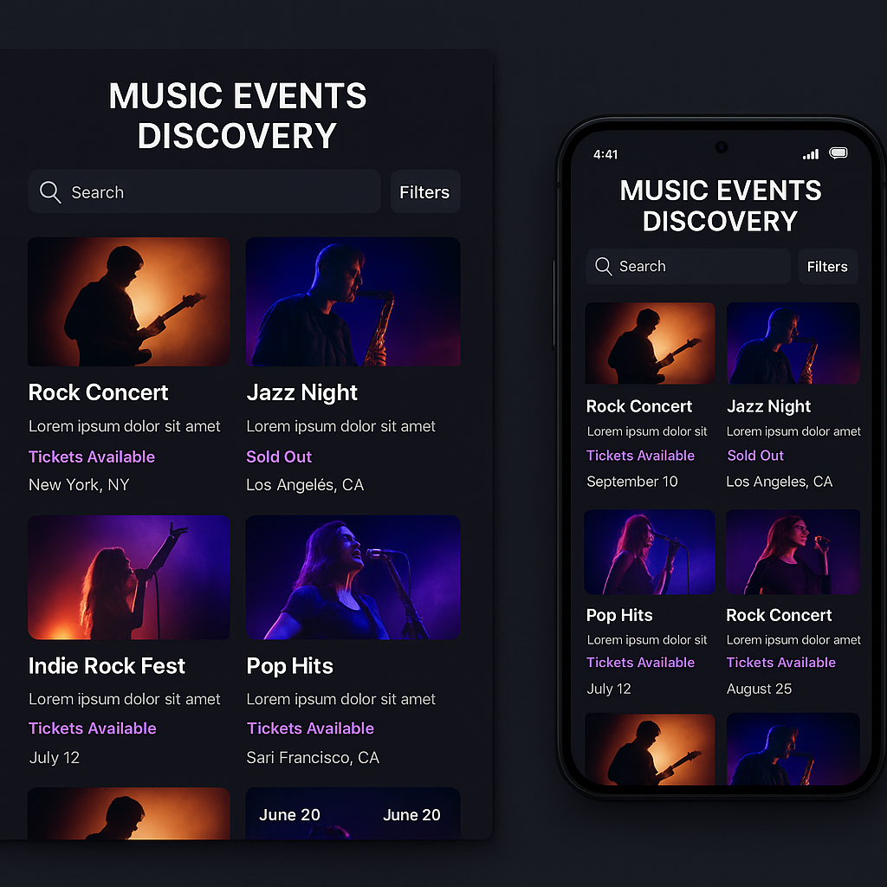

# 🎵 Music Events Discovery

> **⚠️ DISCLAIMER:** Questa applicazione è **solo una dimostrazione** di utilizzo di **vibe coding** con **Bolt**. È stata sviluppata come esempio pratico di sviluppo iterativo e rapido, non come prodotto commerciale.

Una moderna applicazione web per scoprire e gestire eventi musicali, costruita seguendo un approccio di sviluppo iterativo e guidato dall'intuizione.


## 🚀 Sequenza Operativa di Sviluppo

### 1. 🎨 Design e Prototipazione

**Figma Design:** [Visualizza il design originale](https://www.figma.com/design/o30zAO58vSMHHRorlaWAdO/Music-Events-Discovery?node-id=0-1&t=UDpzCvbXn3FB4lEY-1)

**UI Designer** per generare immagine di riferimento e prompt dettagliato:
- Header con titolo, ricerca e filtri categorie
- Griglia eventi con immagine, titolo, descrizione, disponibilità, location e data
- Color Scheme: Grigio scuro, nero e viola
- Style: Moderno e attraente per pubblico giovane



### 2. 🔥 Sviluppo Frontend con Bolt

**Materiale trasferito su Bolt:**
- Design Figma + immagine UI Designer
- Prompt dettagliato delle specifiche

**Iterazioni di sviluppo:**
- Homepage con griglia eventi
- Pagina dettaglio eventi
- Sistema filtri per categorie musicali
- Ricerca in tempo reale
- Componenti React + TypeScript + Tailwind CSS

### 3. 🗄️ Setup Database Supabase

**Configurazione:**
- Creazione account Supabase
- Setup progetto e configurazione URL/keys
- Creazione tabella `events` con schema completo
- Configurazione storage bucket per immagini

**Integrazione:**
- Connessione frontend con Supabase client
- Implementazione CRUD operations
- Gestione upload immagini

### 4. 👥 Sistema Autenticazione

**Implementazione:**
- UI per registrazione e login
- Integrazione Supabase Auth
- Protezione routes e funzionalità
- Gestione stati utente e permessi

## 🛠️ Stack Tecnologico

- **Frontend:** React 18 + TypeScript + Vite
- **Styling:** Tailwind CSS
- **Database:** Supabase (PostgreSQL)
- **Autenticazione:** Supabase Auth
- **Storage:** Supabase Storage (per immagini eventi)
- **Icons:** Lucide React
- **Deployment:** Vite build system

## 🎨 Caratteristiche Principali

### 🏠 Homepage
- **Griglia responsive** di eventi musicali
- **Filtri per categoria** (Rock, Jazz, Indie, Pop, Electronic, Country)
- **Ricerca in tempo reale** per titolo e venue
- **Design moderno** con tema scuro e accenti viola

### 📱 Eventi
- **Visualizzazione dettagliata** con immagini, descrizioni, date
- **Sistema di biglietti** con stati (Disponibili, Esauriti, Limitati)
- **Informazioni complete:** venue, prezzo, capacità, organizzatore
- **Rating** e sistema di valutazione

### 👤 Autenticazione
- **Registrazione** con username, email e password
- **Login** sicuro con gestione errori
- **Protezione** delle funzionalità di creazione/modifica eventi
- **Gestione sessioni** utente

### ✨ Funzionalità Avanzate
- **Creazione eventi** con upload immagini
- **Modifica/eliminazione** eventi (solo per i proprietari)
- **Filtro "I miei eventi"** per utenti autenticati
- **Upload immagini** con preview
- **Responsive design** per mobile e desktop

## 🗃️ Struttura Database

### Tabella `events`
```sql
- id (primary key)
- title (text) - Titolo evento
- date (date) - Data evento
- time (time) - Orario inizio
- duration (text) - Durata evento
- venue (text) - Nome venue
- price_range (text) - Fascia di prezzo
- capacity (integer) - Capacità massima
- organizer (text) - Organizzatore
- description (text) - Descrizione
- rating (decimal) - Valutazione (0-5)
- available (boolean) - Disponibilità biglietti
- category (text) - Categoria musicale
- image (text) - URL immagine
- user_id (uuid) - ID creatore evento
```

### Storage
- **Bucket `event-images`** per le immagini degli eventi
- **Policies di sicurezza** per upload/download

## 🚀 Come Avviare il Progetto

### Prerequisiti
- Node.js 18+
- Account Supabase
- Git

### Installazione

1. **Clona il repository**
```bash
git clone <repository-url>
cd music-events-discovery
```

2. **Installa le dipendenze**
```bash
cd src
npm install
```

3. **Configura Supabase**
```bash
# Crea un file .env nella cartella src
VITE_SUPABASE_URL=your_supabase_url
VITE_SUPABASE_ANON_KEY=your_supabase_anon_key
```

4. **Esegui le migrazioni**
```bash
# Applica le migrazioni nel tuo progetto Supabase
# File: supabase/migrations/
```

5. **Avvia il server di sviluppo**
```bash
npm run dev
```

## 🎯 Approccio di Sviluppo

Questo progetto dimostra un approccio di sviluppo iterativo e rapido:

1. **🎨 Design first:** Prototipazione in Figma + UI Designer
2. **⚡ Sviluppo rapido:** Implementazione con Bolt
3. **🔄 Iterazione continua:** Feedback immediato e miglioramenti
4. **🚀 Integrazione progressiva:** Database e autenticazione step-by-step

## 📸 Screenshots


## 🔮 Prossimi Passi

Il progetto è pronto per essere esteso con:
- **Sistema di prenotazioni** biglietti
- **Notifiche** per nuovi eventi
- **Sistema di recensioni** utenti
- **Integrazione** con mappe per location
- **Chat** tra organizzatori e partecipanti

## 🤝 Contribuire

Questo progetto è una dimostrazione - sentiti libero di:
- **Sperimentare** con nuove funzionalità
- **Iterare** rapidamente
- **Esplorare** approcci di sviluppo alternativi

## 📄 Licenza

Questo progetto è open source e disponibile sotto licenza MIT.

---

*Costruito come dimostrazione di sviluppo iterativo con Bolt e Supabase*
